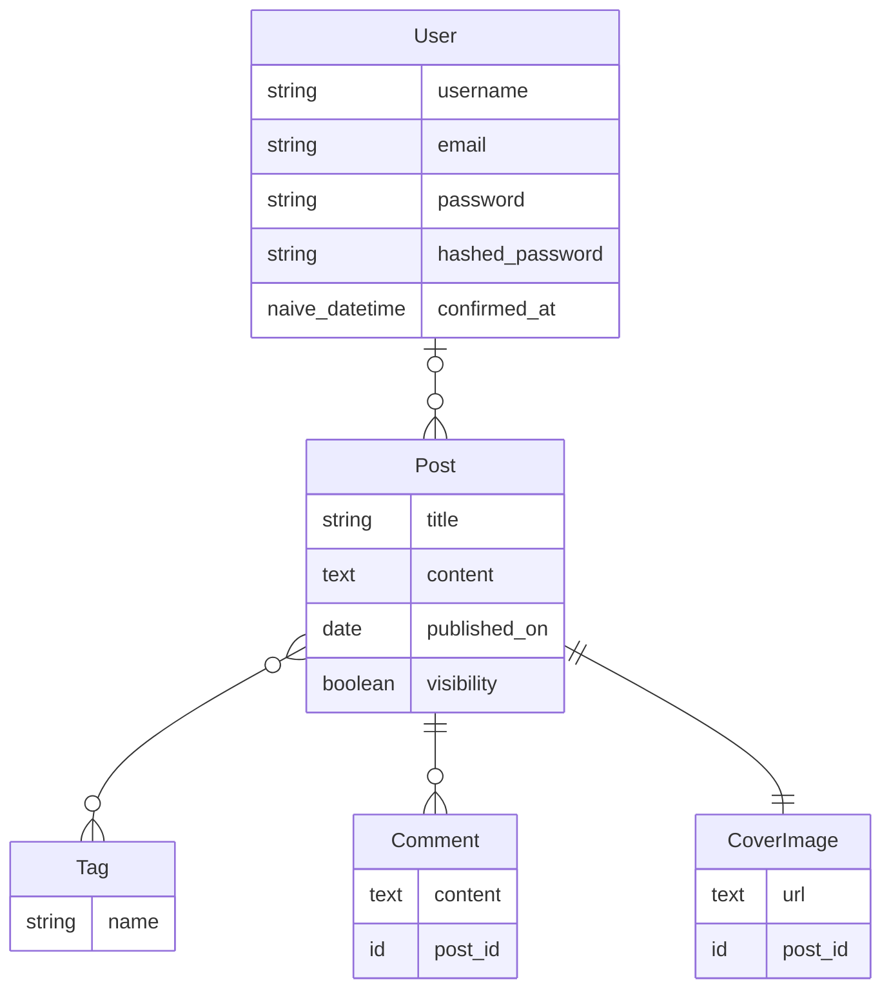

# Elixir Blog project

- A dockyard curriculum project

# Technologies:

- Elixir
- Phoenix
- Ecto

# Project features:

- Posts, with a cover image
- Users
- Tags
- Comments
- Authentication + Authorization

# Entity relationship diagram

